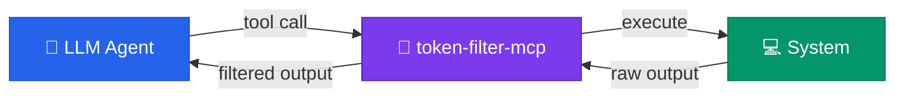

<div align="center">

# 🧹 token-filter-mcp

**Your LLM is wasting 80% of its context window on noise.**<br>
**This fixes that.**

[](https://www.npmjs.com/package/token-filter-mcp)
[](./LICENSE)
[](https://nodejs.org)
[](https://modelcontextprotocol.io)

<br>


<br><br>

An MCP server that sits between your AI coding assistant and its tools,<br>
intelligently compressing outputs before they consume your precious context.<br>
**Longer sessions. Better reasoning. Lower costs.**

</div>

---

<br>

## 💸 The Problem Nobody Talks About

Every time your AI assistant runs a command, it dumps the **entire raw output** into its context window:

```diff
+ ✓ src/auth.test.ts (14 tests)          ← you don't need this
+ ✓ src/utils.test.ts (8 tests)          ← or this
+ ✓ src/payments.test.ts (12 tests)      ← or this
+ ✓ src/users.test.ts (10 tests)         ← or this
- ✗ src/orders.test.ts (3 tests)         ← THIS is what matters
-   ● should validate quantity > 0
-     Expected: error
-     Received: success
```

The vast majority of tool output is noise: tests that pass, git headers, resolution trees, progress bars, whitespace. **~80% of what goes into the context window is information the LLM will never act on.**

That noise eats your context window, degrades reasoning quality, and costs you money.

<br>

## ⚡ The Solution

<table>
<tr>
<td width="50%">

### ❌ Without token-filter-mcp

- Context fills up fast
- LLM loses track of conversation
- Paying for tokens it ignores
- Sessions hit context limit early
- Reads 14 lines to find 1 failure

</td>
<td width="50%">

### ✅ With token-filter-mcp

- Context stays lean
- LLM maintains coherence longer
- Only paying for useful tokens
- Sessions last significantly longer
- Reads exactly the failure, acts immediately

</td>
</tr>
</table>

> **token-filter-mcp** intercepts every tool output and applies intelligent, context-aware filtering — returning only what the LLM actually needs to make decisions.
>
> **No configuration needed. No changes to your workflow. Just plug it in.**

<br>

## 🎯 Real Results

<table>
<tr>
<th>Scenario</th>
<th>Without filter</th>
<th>With filter</th>
<th>Savings</th>
</tr>
<tr>
<td><code>npm test</code> (57 tests, all pass)</td>
<td>295 chars / 14 lines</td>
<td>23 chars / 1 line</td>
<td><b>🟢 92%</b></td>
</tr>
<tr>
<td><code>npm test</code> (3 failures)</td>
<td>~5,200 chars</td>
<td>~480 chars</td>
<td><b>🟢 91%</b></td>
</tr>
<tr>
<td>File read (signatures mode)</td>
<td>7,992 chars / 243 lines</td>
<td>483 chars / 9 lines</td>
<td><b>🟢 94%</b></td>
</tr>
<tr>
<td>20 repeated log lines</td>
<td>312 chars / 22 lines</td>
<td>33 chars / 2 lines</td>
<td><b>🟢 89%</b></td>
</tr>
<tr>
<td>Long unknown command (150 lines)</td>
<td>3,492 chars / 151 lines</td>
<td>2,342 chars / 101 lines</td>
<td><b>🟡 33%</b></td>
</tr>
</table>

> Average savings across real-world tool outputs: **60-90% fewer tokens consumed**

<br>

## 🧠 How It Works



<table>
<tr>
<td>

**1️⃣ Detect** — Identifies what command was run (test runner? git? linter?)

**2️⃣ Execute** — Runs the command and captures full output

**3️⃣ Filter** — Applies the optimal strategy for that command type

**4️⃣ Verify** — Ensures no errors or actionable info was removed

**5️⃣ Return** — Sends compressed output to the LLM

</td>
</tr>
</table>

### 🎨 Contextual Detection

The server doesn't blindly truncate. It **understands what you ran** and applies the right strategy:

| It detects... | And does this... |
|:---|:---|
| 🧪 Test runners (jest, vitest, pytest, cargo test, go test) | Strips passing tests. Shows only failures with location + expected/received |
| 📊 `git status` | Converts to `M 3 \| A 1 \| D 0 \| ? 2` + file list |
| 📝 `git diff` | Removes repeated headers, keeps only hunks with ±3 context |
| 📜 `git log` | One-liner: `abc1234 feat: add auth (2h ago)` × 15 max |
| 🔍 Linters (tsc, eslint, biome, ruff) | Groups errors by rule/file, omits clean files |
| 📦 Package installs | Returns `ok + 847 packages` instead of the resolution tree |
| ❓ Unknown commands | Conservative: deduplicate + truncate to 100 lines |

### 🛡️ Zero Information Loss

The #1 design principle: **never hide an error.**

```
✅ Lines matching error patterns (FAIL, Error:, TypeError, panic...) → NEVER removed
✅ Non-zero exit codes → full error output preserved
✅ Parser can't understand format → returns raw output
✅ passthrough mode available for when you need everything
```

<br>

## 🚀 Installation

<details open>
<summary><b>Using npx (recommended, zero install)</b></summary>

Add this to your MCP client config — that's it:

```json
{
  "mcpServers": {
    "token-filter": {
      "command": "npx",
      "args": ["-y", "token-filter-mcp"]
    }
  }
}
```

</details>

<details>
<summary><b>Global install</b></summary>

```bash
npm install -g token-filter-mcp
```

```json
{
  "mcpServers": {
    "token-filter": {
      "command": "token-filter-mcp"
    }
  }
}
```

</details>

<br>

### 📍 Where does the config go?

| Client | Config file |
|:---|:---|
| **Kiro** | `.kiro/settings/mcp.json` or `~/.kiro/settings/mcp.json` |
| **Claude Desktop** | `claude_desktop_config.json` |
| **Cursor** | `.cursor/mcp.json` |
| **Any MCP client** | Wherever it reads `mcpServers` config |

<br>

## 🔧 7 Tools, One Purpose

<details open>
<summary><h3>⚡ <code>filtered_shell</code> — Run anything, get only what matters</h3></summary>

```json
{ "command": "npm test", "filter_level": "normal" }
```

| Level | Behavior |
|:---|:---|
| `normal` | Smart filtering with sensible defaults |
| `aggressive` | 50% additional reduction for tight context budgets |
| `passthrough` | Raw output when you need everything (capped at 200KB) |

</details>

<details>
<summary><h3>📖 <code>filtered_read</code> — Read files without the bloat</h3></summary>

```json
{ "path": "src/app.ts", "mode": "signatures" }
```

| Mode | What it returns |
|:---|:---|
| `full` | Content minus blank blocks, license headers, grouped imports |
| `signatures` | Only declarations — no implementation bodies |
| `relevant` | Only sections matching `focus` pattern with ±10 lines context |

Supports: TypeScript, JavaScript, Python, Rust, Go

</details>

<details>
<summary><h3>🔍 <code>filtered_grep</code> — Search without the wall of text</h3></summary>

```json
{ "pattern": "useState", "path": "src", "group_by": "file", "max_results": 20 }
```

Results grouped by file, deduplicated, with context lines. Uses ripgrep when available.

</details>

<details>
<summary><h3>🧪 <code>smart_test</code> — Tests that report only what broke</h3></summary>

```json
{ "command": "npm test" }
```

**All pass:**
```
[PASS] 47/47 tests passed (3.2s)
```

**Failures:**
```
[PASS] 44/47 tests passed
[FAIL] 3 failures:

1. src/auth.test.ts:42 — "should refresh token"
   Expected: 200
   Received: 401

2. src/payments.test.ts:89 — "should validate 3DS"
   TypeError: Cannot read property 'status' of undefined
   at processPayment (src/payments.ts:156)
```

Auto-detects: Jest, Vitest, pytest, cargo test, go test

</details>

<details>
<summary><h3>🌿 <code>smart_git</code> — Git without the verbosity</h3></summary>

```json
{ "operation": "status" }
```

| Operation | What you get |
|:---|:---|
| `status` | `M 3 \| A 1 \| D 0 \| ? 2` + file list |
| `diff` | Only hunks with changes, no header spam |
| `log` | `abc1234 feat: add auth (2h ago)` × 15 |
| `commit` | `ok abc1234` |
| `push` | `ok main → origin/main` |
| `pull` | `ok +3 files, 47 insertions` |

</details>

<details>
<summary><h3>📱 <code>smart_adb</code> — Drive Android without screenshots + vision</h3></summary>

```json
{ "operation": "dump", "device": "emulator-5554" }
```

| Operation | What it does |
|:---|:---|
| `dump` | Compact accessibility tree: resource-id, text, clickable, tap-center |
| `tap` | Resolve `resource_id`/`text`/`content_desc` to its bounds center and tap it |
| `tap_xy` | Tap raw coordinates (last resort, e.g. a map/canvas view) |
| `key` | Symbolic `KEYCODE_*` keyevent only — raw numeric codes are rejected |
| `type` | Send text to the focused field |
| `swipe` | Swipe from `(start_x,start_y)` to `(end_x,end_y)` |
| `long_press` | Long-press a locator (`resource_id`/`text`/`content_desc`) or raw x/y |
| `install` / `uninstall` | Install an APK from a local path / remove by package name |
| `logcat` | Recent logcat output pre-filtered to error/warning lines only |

Replaces the "screenshot → vision → guess coordinates → tap → screenshot again" loop with cheap structured text.

</details>

<details>
<summary><h3>📈 <code>metrics_summary</code> — Check your actual savings on demand</h3></summary>

```json
{ "tool": "smart_git", "limit": 100 }
```

Aggregates `~/.config/token-filter-mcp/metrics.jsonl` (plus rotated history) into invocation count, raw vs filtered chars, overall savings %, and a per-tool breakdown sorted by chars saved — without reading the JSONL file by hand.

</details>

<br>

## ⚙️ Configuration (Optional)

> Works great out of the box. Customize only if you want to.

<details>
<summary><b>Per-project config</b> — <code>.token-filter.json</code></summary>

```json
{
  "defaults": {
    "max_output_lines": 100,
    "test_show_passes": false,
    "git_log_max": 15,
    "diff_context_lines": 3,
    "dedup_threshold": 3
  },
  "commands": {
    "my-custom-script.sh": { "filter_level": "passthrough" }
  },
  "metrics": { "enabled": true }
}
```

</details>

<details>
<summary><b>Global config</b> — <code>~/.config/token-filter-mcp/config.json</code></summary>

Same schema. Project config overrides global. Global overrides built-in defaults.

</details>

<br>

## 📊 Built-in Observability

<details>
<summary>View metrics details</summary>

When enabled, every invocation is logged to `~/.config/token-filter-mcp/metrics.jsonl`:

```json
{
  "tool": "smart_test",
  "command": "npm test",
  "rawChars": 5200,
  "filteredChars": 480,
  "savingsPercent": 90.7,
  "strategy": "test_result_filter",
  "filterDurationMs": 3,
  "timestamp": "2026-06-30T15:30:00Z"
}
```

Auto-rotated at 5MB, max 5 history files.

**What it tracks:**
- Real savings per tool and command type
- Which filters are most effective
- Passthrough re-invocations (signal that a filter might be too aggressive)

Query it anytime with the `metrics_summary` tool instead of reading the JSONL by hand.

</details>

<br>

## 🛡️ Guarantees

| Guarantee | Detail |
|:---|:---|
| 🔒 **Zero loss** | Errors, test failures, and changes are never filtered out |
| ⚡ **< 50ms overhead** | Filtering adds negligible latency vs raw execution |
| 🪂 **Safe fallback** | Unknown commands get conservative treatment, not silence |
| 🔌 **No lock-in** | Standard MCP protocol — works with any compliant client |
| 🏠 **No network** | Everything runs locally over stdio. Your code never leaves your machine |

<br>

## 🛠️ Development

```bash
git clone https://github.com/VMexicano/token-filter-mcp
cd token-filter-mcp
npm install
npm run build
npm test        # 57 tests, all passing
```

<br>

---

<div align="center">

**The best token is the one you never spend.**

<br>

Made with 💖 by [Victor Mexicano](https://github.com/VMexicano)

</div>
